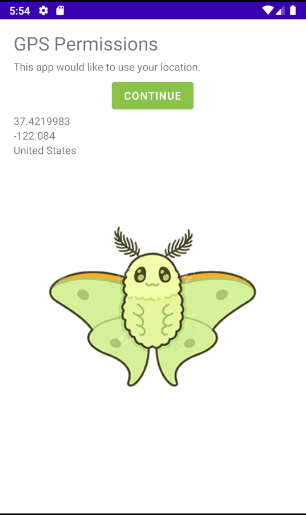
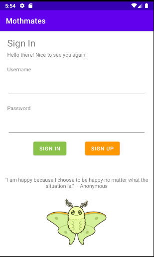
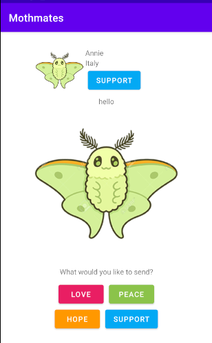
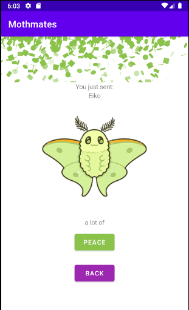

# Mothmates
Assignment: CS4518-FinalProject

Authors: Madeline Perry and Jyalu Wu

## Description
In this time of isolation, many people around the world struggle with loneliness and mental health. Our app, Mothmates, creates a space where users can link up with each other to send messages of validation and compassion in order to remind one another that they are not alone. The mascot of our app, a moth, represents how people are drawn together by intrapersonal connections like moths are drawn to light.

Our app uses the MVC design pattern and stores data about the user in the device’s local filesystem. Additionally, the app connects to the device’s GPS to determine what country its users are in, and connects to the Inspiration API to provide users with inspirational messages upon login. 

## Screenshots

Screen showing the user's current location - this is the first screen the user will see upon opening the app.

The login screen - login information will be stored in the user's local storage database. An inspirational quote is also shown.

The main screen shows the second user's name, location, and message. The user can choose what message to send back to the other user.

A screen showing confirmation that the user's message was sent to the other user, accompanied with confetti.

## Technical Achievements
- The first is Mothmates’ login feature, which makes use of a local database to allow users to create an account and log in to the app. Upon account creation, the user’s information is added into the table. Upon a login, the app checks the tables to make sure an account exists with that username and password.

- The second is extending the GPS functionality of our app to determine what country the user is in based on their geographic coordinates via the Geocoder class. A user can choose whether or not their country is displayed to others.

## Design Achievements
- We utilized the Konfetti library to add some visual flair in our app. When a user sends their partner a message, a burst of confetti particles fills the screen in the same color that corresponds to the emotion that they sent. 

- In addition, the use of bright colors and cute cartoon stock images of moths improves the app's appearance and makes it very satisfying to use.
